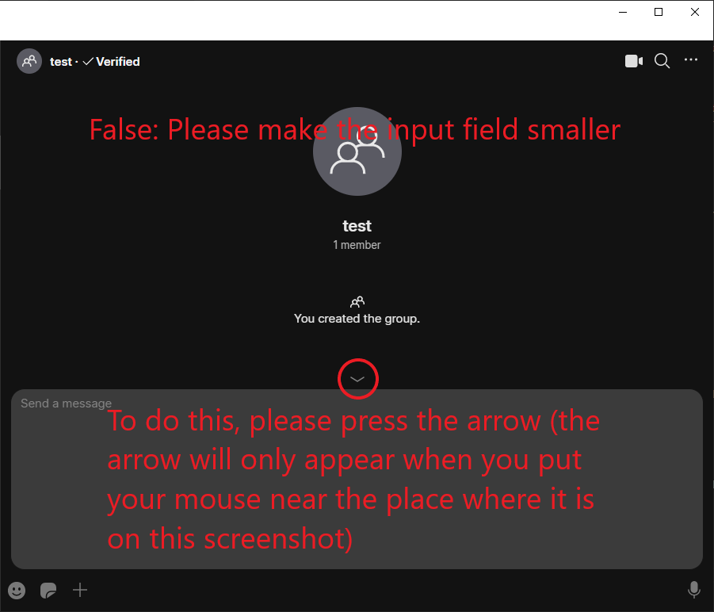
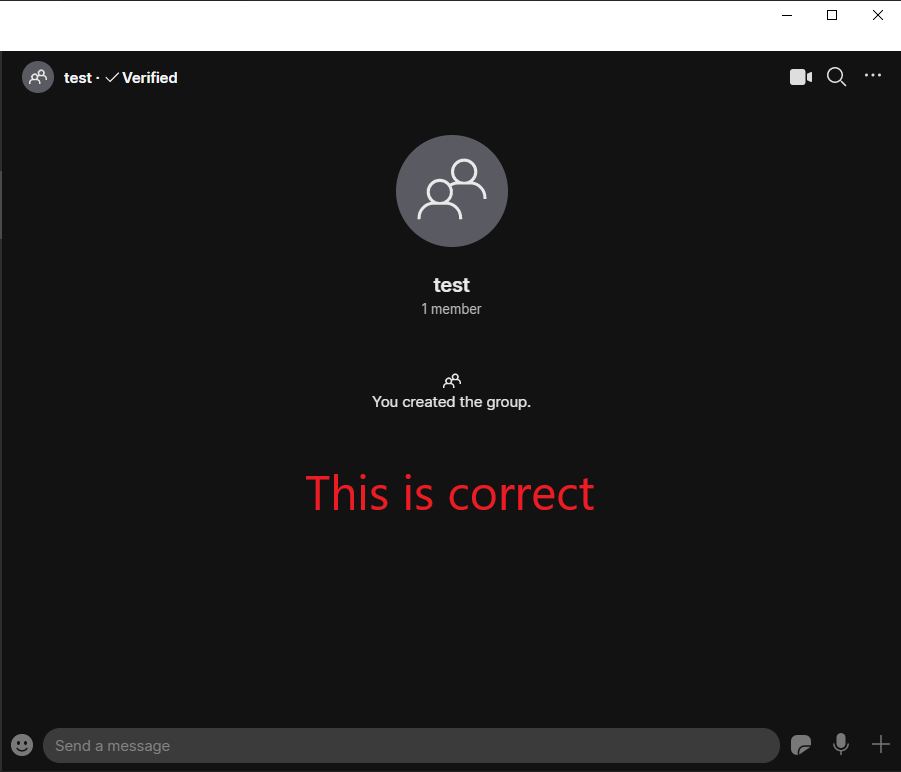
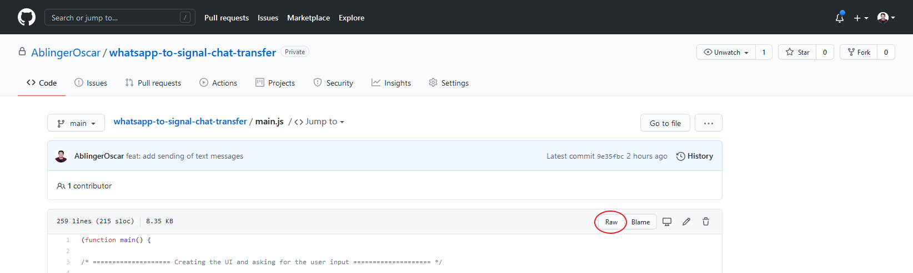
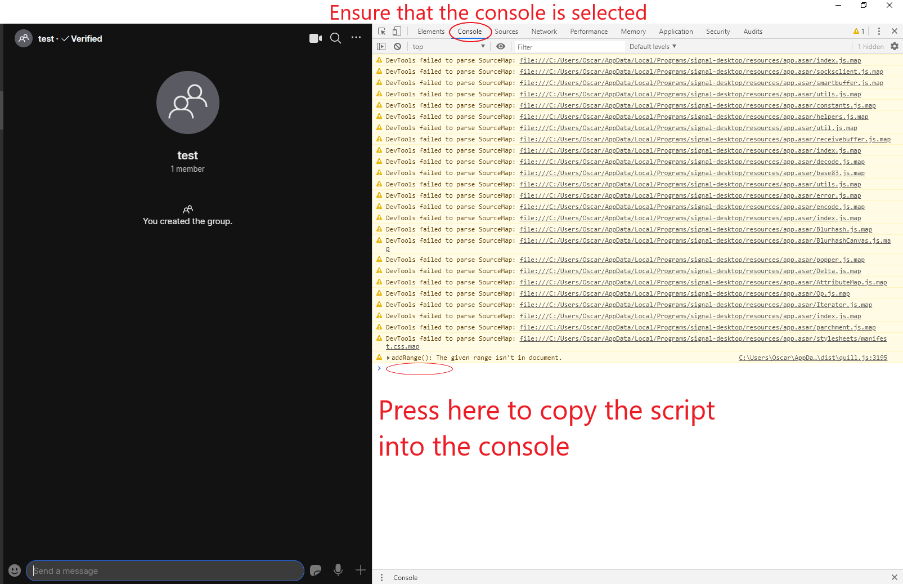

# Userguide

> If you are a programmer, you can use this [shorter user guide](userguide_pros.md) instead, that skips some steps that you should know how to do as a programmer.

## Prerequesites

- [Signal desktop app in which you're "logged in" (You can send messages through it)](https://www.signal.org/download/)
- Access to your Whatsapp app and the chat that you want to export
- A person that you trust and that can understand a bit of JavaScript

## Step 1: Ensure that you can trust me

In order for this script to send messages, it needs to have full access to the user interface your Desktop Signal app.
While it doesn't do anything other than send a few messages, it _could_ do some malicious things.
So before continuing please ensure that a person that you trust and that can understand JavaScript has looked over the code and can vouch for its "niceness".
Have them send you the link to the script to ensure that they looked at the same code that you are then using.

## Step 2: Export your Whatsapp chat history

Whatsapp's FAQ has a tutorial on how to get your [chat history](https://faq.whatsapp.com/android/chats/how-to-save-your-chat-history/?lang=en).
Follow the instruction under the point "Export chat history" (**Not** "Back up chats" – we don't need that here).
Sadly it only allows you to do this for one chat at a time.

When following that guide, you will get one or more files.
Usually your phone will ask you what you want to do with them.

We need to have them on the same PC on which you installed the Signal app.
While it doesn't matter how you get them onto your PC, here are a few options on how to do it – not all of them might be shown to you, depending on your settings:

- Save it as files on your phone (usually shown as "File Manager" or "Files").
    In this case, please make sure to save each chat in its own folder so that later you are able to differenciate between the different ones.
    Then follow any tutorial on how to get your files onto your computer (see, for instance, [this tutorial by Google itself](https://support.google.com/android/answer/9064445?hl=en) – I recommend prefering the USB cable approach, but both work)
- Send via Signal (after they are sent, you can then switch to your PC Signal app and download the files from there)
- Send via Email (after they are sent, you can then open your emails on your PC and download the files from there)

In any of those options, you should then end up with the files on your PC.
Please ensure that the files of each chat are in their own folder, so you are able to differentiate between the different chats.
(If you decided against exporting media or if there was no media in the chat, then you will only have one file – this is fine, too).

> Note that, if you choose to not export media, then whatsapp will replace the entire message with `<Media omitted>`.
> This script automatically filters those out, but this also means that text that was sent alongside some media will _not_ show up (as whatsapp doesn't export those).

## Step 2: Open the "developer console" on the Signal web app

On the Signal app now select the group or person that you want to restore the history with.
Note that this will essentially be you sending all of the messages into the chat, so if others are in it, they will also receive all of those messages.

At the bottom of the app, you should see a small input field through which you can send messages.
Please ensure that it is small and not expanded!

When you are in the correct chat and can see the small text area, you can now open the "Developer console".
To do this either press `Ctrl+Shift+I` or select `View > Toggle Developer Tools` in the top left menu.
This should prompt a white box to open on the right side of the Signal app.
Don't worry – you do not need to understand anything in this view.

In the new area, at the top, there are a few tabs that you can select ("Elements", "Console", "Sources" etc.).
Click on "Console" to select the console view (it will be underlined blue).
There are likely some yellow warnings or red errors shown – this is unproblematic and you can ignore them.

## Step 3: Copy the script

In step 1 a trusted person read through the code and sent you a link to the script.
Now copy this script.

If the link they sent you looks like this:

…you can click on the "Raw" button (circled in red in the screenshot) and then select the entire text (you can press `Ctrl+A` to do this quickly) and copy it.
(You can copy selected text by pressing `Ctrl+C` or right-clicking and selecting `Copy`)

# Step 4: Execute the script

Switch back to the Signal app and into the console.
Beneath the last line in the console tab, you should see a `>` and afterwards your cursor.
If you don't please click a bit to the right of the `>` until your cursor appears.

Now copy the script either by pressing `Ctrl+V` or right-clicking a bit to the right of the `>` and selecting `Copy`.
Now a bunch of text should be inserted into the field.
Press enter to execute it.

# Step 5: Upload your whatsapp history

After pressing enter another white area should appear above your chat.
In there, there is a button next to the text "Upload your files" called "Choose Files" (although that name can differ if your computer uses a different language than english).
Press on it and select all of the files that whatsapp created from **one** chat.
This usually includes one file that is named "WhatsApp Chat (name of the chat)" and, if you chose to export media, some images and/or other files.

When you've selected all of them, you can press `Start`.
After you pressed `Start` **please do not interact with the Window at all until you see a popup that tells you that all messages have been successfully imported.**

Alternatively you can also press `Abort` to not do anything.

> Congratulations: You should now see all of the texts that you had in your whatsapp chat in Signal. Note that they are all sent by you now, instead of their original sender.

# (optional) Step 6: Import chat history of other chats

After you've followed the above steps and have since not closed the Signal app, you do not need to close the developer console in between switching chats.
You can simply select your next chat in the Signal app and then paste the script into the developer window again and the popup will appear again.
Then simply upload the correct files for that chat and press `Start` and so on and so forth.

I hope this was useful :)
